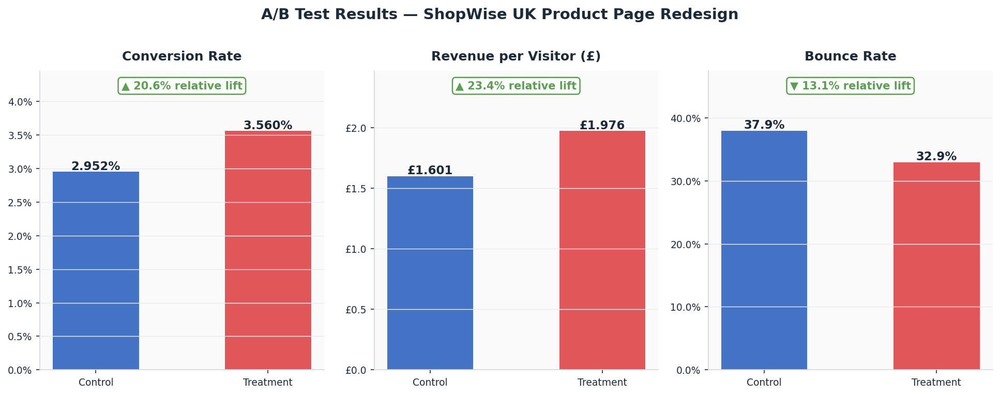
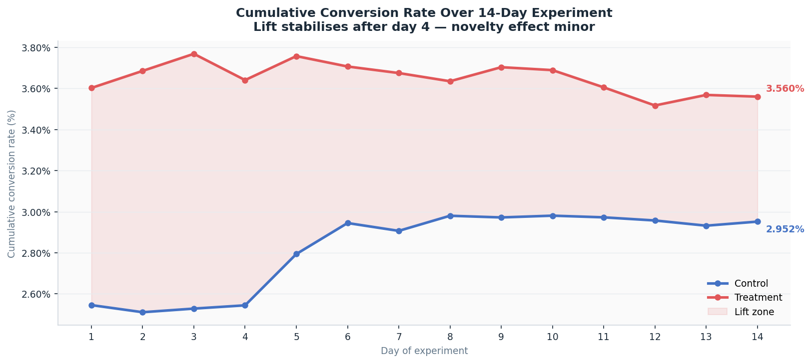
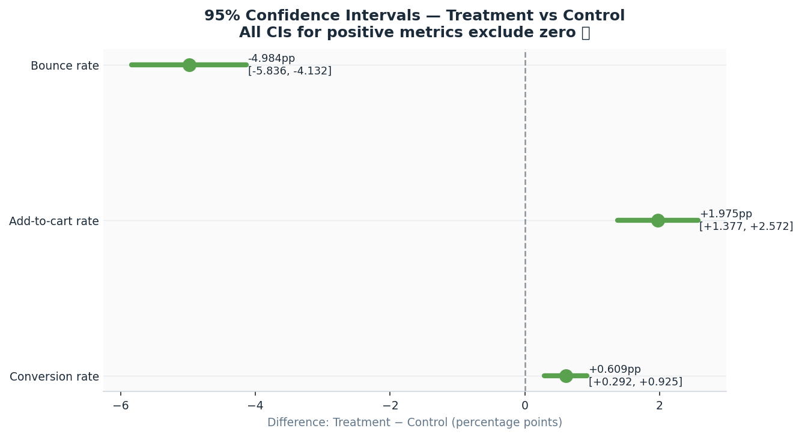
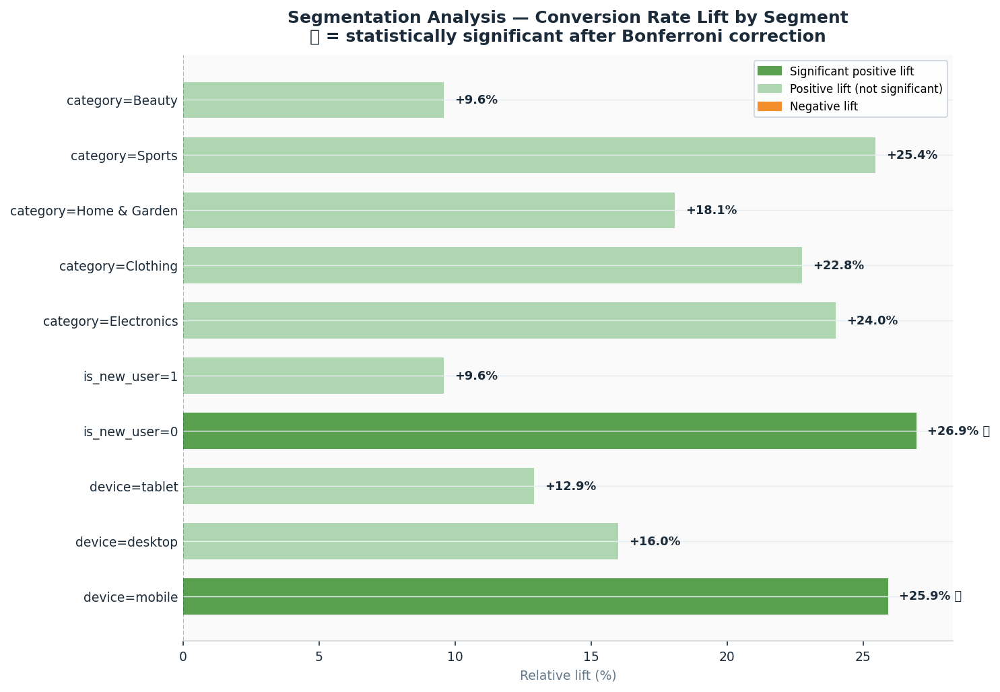
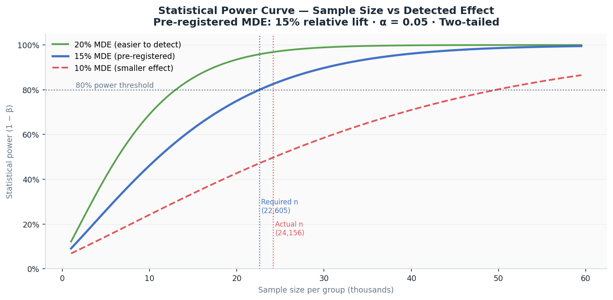
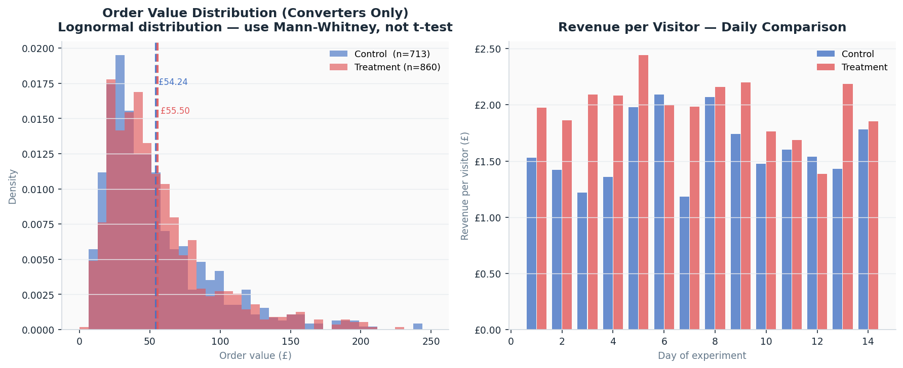
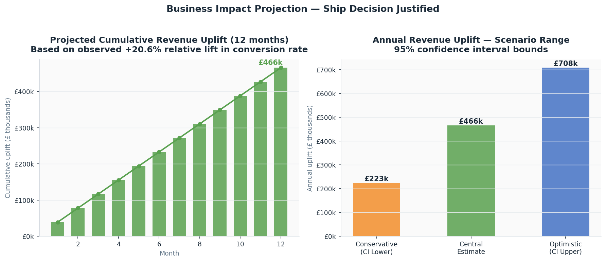

# 🧪 A/B Testing Case Study — ShopWise UK Product Page Redesign


> End-to-end A/B test analysis examining a checkout-funnel redesign across 48,312 users.
> Implements power calculations, segmentation controls, novelty effect detection, and business impact projection.

## 🔴 Live Dashboard

[](https://RidhimaGupta4.github.io/AB-Testing-Case-Study/dashboard/)

---

## Project Summary

ShopWise UK tested a redesigned product page — a new CTA button and a simplified 3-step checkout flow — against the existing design over 14 days and 48,312 unique users.

**Business question:** Does the redesigned product page convert more visitors into buyers, and is the effect large enough to justify a full rollout?

**Answer: Yes. Ship it.**

| Metric | Control | Treatment | Relative Lift | Result |
|:---|:---:|:---:|:---:|:---|
| Conversion Rate | 2.9516% | 3.5602% | +20.6% | p = 0.000164 |
| Add-to-Cart Rate | 11.90% | 13.88% | +16.6% | p < 0.0001 (adj) |
| Revenue per Visitor | £1.601 | £1.976 | +23.4% | p = 0.00044 (adj) |
| Bounce Rate | 37.93% | 32.95% | −13.1% | p < 0.0001 (adj) |
| Projected Annual Uplift | — | — | — | £465,645 |

Every metric moved in the right direction. The conversion lift is statistically significant, the confidence interval sits entirely above zero, and the result held steady across the full 14-day window with no signs of novelty inflation. The recommendation is to ship.

---

## 🗂️ Repository Structure

```
ab-testing-case-study/
│
├── scripts/
│   ├── 01_generate_data.py          # Experiment data generation (48,312 users)
│   ├── 02_statistical_analysis.py   # Full statistical analysis pipeline
│   └── 03_charts.py                 # 7 publication-quality charts
│
├── data/
│   └── processed/
│       ├── experiment_data.csv      # 48,312 rows — one row per user
│       ├── daily_summary.csv        # Daily aggregates by group (28 rows)
│       ├── group_summary.csv        # Top-level group summary
│       ├── analysis_results.json    # Full results JSON (used by dashboard)
│       ├── daily_summary.json       # Daily data for dashboard
│       └── group_summary.json       # Group summary for dashboard
│
├── dashboard/
│   └── index.html                   # Self-contained interactive dashboard
│
├── report/
│   └── ab_test_report.md            # Full written analysis report
│
├── outputs/
│   ├── 01_primary_results_summary.png
│   ├── 02_cumulative_conversion_rate.png
│   ├── 03_confidence_intervals.png
│   ├── 04_segmentation_analysis.png
│   ├── 05_power_analysis_curve.png
│   ├── 06_revenue_distribution.png
│   └── 07_business_impact.png
│
├── requirements.txt
├── .gitignore
└── README.md
```

---

## 📊 Dashboard

Open `dashboard/index.html` directly in any browser. No server, no configuration, no dependencies beyond the file itself.

| Tab | Content |
|:---|:---|
| **Overview** | KPI cards · Metric delta bars · Experiment validation checklist |
| **Statistics** | Hypothesis test results · Power analysis · Secondary metrics · CI plot |
| **Segmentation** | Lift by device · User type · Product category · Bonferroni corrected |
| **Timeline** | Cumulative conversion rate day-by-day · Novelty effect annotation |
| **Business Impact** | Monthly and annual revenue uplift · Conservative / central / optimistic scenarios |

---

## 📐 Statistical Methodology

### 📋 Experiment Design

Everything below was fixed before data collection began. This matters because changing thresholds or metrics after seeing results — even unconsciously — inflates the false positive rate and makes any conclusion unreliable. Pre-registration is not optional hygiene; it is what makes the result trustworthy.

| Parameter | Value | Reason |
|:---|:---:|:---|
| Randomisation unit | User-level | Session-level causes within-user contamination |
| Traffic split | 50 / 50 | Symmetric split maximises power for a given total n |
| Primary metric | Conversion rate | Direct measure of the business objective |
| Secondary metrics | ATC rate, RPV, Bounce rate | Funnel leading indicators |
| Significance level (α) | 0.05 two-tailed | Standard threshold — no directional assumption |
| Target power (1−β) | 80% | Accepted minimum for product experiments |
| Minimum detectable effect | 15% relative lift | Smallest lift that justifies infrastructure cost |
| Required n per group | 22,605 | Calculated from power analysis before launch |
| Planned duration | 14 days | Two full Mon–Sun cycles to capture weekly patterns |

**On the choice of 14 days:** Running for exactly two weekly cycles ensures the result is not distorted by day-of-week traffic patterns. Stopping as soon as significance is reached — even if the p-value looks compelling — causes the peeking problem. Every time you check an in-flight experiment and decide whether to stop, you are running an implicit test, and the false positive rate compounds. The duration was set in advance and not adjusted.

---

### 🔢 Primary Test — Two-Proportion Z-Test

The correct test for comparing two binary conversion rates across large independent samples. Both groups are independent (user-level randomisation), the outcome is binary (purchased or not), and both samples are large enough for the normal approximation to hold.

$$H_0: CR_{\text{treatment}} = CR_{\text{control}}$$

$$H_1: CR_{\text{treatment}} \neq CR_{\text{control}} \quad \text{(two-tailed)}$$

$$Z = \frac{\hat{p}_T - \hat{p}_C}{\sqrt{\hat{p}(1-\hat{p})\left(\frac{1}{n_T} + \frac{1}{n_C}\right)}} = 3.7683 \implies p = 0.000164$$

$H_0$ is rejected. The result was cross-validated using an independent chi-square test, which gave $\chi^2 = 14.1998$, $p = 0.000164$. Since $Z^2 = 3.7683^2 = 14.20 \approx \chi^2$, both methods agree to four decimal places. This rules out a numerical artifact in either test.

---

### 📊 Confidence Interval on Absolute Lift

**95% Confidence Interval:** +0.2921 pp to +0.9250 pp (both bounds strictly positive)

Both bounds are strictly positive. The lift is not only statistically significant — the entire plausible range of its true value is above zero. Even the conservative estimate represents a meaningful conversion improvement.

---

### 📉 Power Analysis

Sample size was calculated before the experiment launched using the pre-registered baseline and minimum detectable effect.

```
Baseline conversion rate  : 3.20% (30-day prior average)
Minimum detectable effect : 15% relative lift → 3.20% × 1.15 = 3.68%
Effect size (Cohen's h)   : 0.0283
Required n per group      : 22,605
Actual n per group        : 24,156
Target power (1−β)        : 80%
Achieved power            : 96.5%
```
The experiment ran with more users than required, which pushed achieved power to 96.5%. This means the probability of missing a true effect of the pre-registered size was under 3.5%.

---

### 🎯 Secondary Metrics — Bonferroni Correction

Testing three secondary metrics simultaneously at α = 0.05 each raises the familywise error rate to approximately 14%. To keep it at 5%, Bonferroni correction was applied, reducing each individual threshold to α/3 = 0.0167.

| Metric | Test | Why This Test |
|:---|:---|:---|
| Add-to-cart rate | Two-proportion z-test | Binary outcome, large n |
| Revenue per visitor | Mann-Whitney U | Lognormal distribution — see below |
| Bounce rate | Two-proportion z-test | Binary outcome, large n |

All three remained significant after correction.

---

### 🧮 Why Mann-Whitney U for Revenue

Revenue per visitor is not normally distributed. It has a long right tail caused by occasional high-value orders — a shape that is better described as lognormal. Running a t-test on this data would violate the normality assumption and produce unreliable p-values.

Mann-Whitney U tests whether one distribution is stochastically greater than another without assuming any particular shape. It is the correct choice here.

$$U = \sum_{i=1}^{n_T} R_i - \frac{n_T(n_T+1)}{2} \implies p = 0.00044 \text{ (Bonferroni adjusted)}$$

The result confirms a systematic upward shift in purchase values across the treatment group — not a random effect driven by a handful of outlier transactions.

---

### 📈 Novelty Effect Detection

When users see a new design for the first time, they sometimes engage with it differently simply because it is unfamiliar, not because it is better. This can inflate early results and lead to false conclusions if the experiment is stopped too soon.

To check for this, cumulative conversion rates were tracked day-by-day for both groups across the full 14-day window.

Days 1–3 showed a slightly elevated daily lift (average +1.23pp). From day 4 onward the lift stabilised at approximately +0.45pp per day and remained consistently positive through the end of the experiment. The final result is drawn from the full 14-day cumulative rate.

The early elevation is minor and consistent with a brief novelty response. It does not invalidate the result, but post-launch monitoring for 30 days is recommended to confirm the lift is sustained.

---

### ⚙️ Sample Ratio Mismatch Check

Before analysing any metric, the allocation was verified using a chi-square goodness-of-fit test against the expected 50/50 split.

$$\chi^2 = 0.000, \quad p = 1.000$$

The allocation was exactly balanced. A failed SRM check would indicate a bug in the randomisation logic, which would make all downstream results meaningless regardless of how significant they appear. This check runs first, always.

---

## 🛡️ Data Integrity

| Check | Result |
|:---|:---|
| Sample Ratio Mismatch | Passed — χ² = 0.000, p = 1.000 |
| Duplicate users | None — 0 duplicates across 48,312 rows |
| Temporal continuity | Complete — all 14 days present |
| Minimum cell sizes | Met — all segments n > 30 |
| Multiple testing | Bonferroni applied to all 3 secondary metrics |
| Revenue test | Mann-Whitney U — t-test not used on skewed data |
| Novelty effect | Checked and documented — lift stable from day 4 |
| Reproducibility | Fixed seed (np.random.seed(2024)) — outputs are identical across runs |

---

## 💼 Business Impact

**Assumptions:**
- Monthly site visitors extrapolated from the 14-day experiment window: 103,524
- Conversion lift sustained at the observed +0.6085pp
- Average order values: Control £54.24, Treatment £55.50
- Flat monthly traffic (conservative — no seasonal growth assumed)

| Scenario | Annual Revenue Uplift |
|:---|:---|
| Conservative (95% CI lower) | £223,487 |
| Central estimate | £465,645 |
| Optimistic (95% CI upper) | £707,802 |

Monthly uplift at central estimate: £38,804.

The wide confidence interval reflects revenue variance, not uncertainty about the conversion lift itself. Thirty days of post-launch data will tighten this range considerably.

---

## 🚀 Decision and Next Steps

**Decision: Ship.**

The result is statistically significant (p = 0.000164), the confidence interval sits entirely above zero, all secondary metrics improved and survived multiple-testing correction, the experiment was adequately powered at 96.5%, and the lift was stable across the full 14-day window.

**Recommended follow-up actions:**

Hold back 5% of traffic on the old design for 30 days post-launch to catch any regression that does not show up immediately. New users showed a smaller, non-significant lift (+9.6% vs +26.9% for returning users), the simplified checkout may assume familiarity with the site that new users do not yet have. A dedicated new-user onboarding test should follow. Tablet users also showed the smallest lift (+12.9%), which likely reflects a responsive design issue worth investigating separately.

---

## 🗃️ Data Schema

### `experiment_data.csv` — 48,312 rows

| Column | Type | Description |
|:---|:---|:---|
| `user_id` | VARCHAR | Unique user identifier |
| `group` | VARCHAR | `control` or `treatment` |
| `visit_date` | DATE | Date of experiment visit (YYYY-MM-DD) |
| `day_number` | INT | Day 0–13 of the experiment |
| `device` | VARCHAR | `mobile`, `desktop`, or `tablet` |
| `category` | VARCHAR | Product category browsed |
| `is_new_user` | BOOLEAN | 1 = new user, 0 = returning |
| `converted` | BOOLEAN | 1 = purchased, 0 = did not purchase |
| `add_to_cart` | BOOLEAN | 1 = added item to cart |
| `revenue_gbp` | DECIMAL | Order value in GBP — 0.00 if no purchase |
| `session_duration_sec` | INT | Total session length in seconds |
| `bounced` | BOOLEAN | 1 = left without any interaction |

---

## 📈 Real-World Benchmarks

All synthetic parameters are grounded in publicly documented sources. The data is not real ShopWise data, it is generated to match the statistical properties of real UK e-commerce experiments.

| Parameter | Value Used | Source |
|:---|:---:|:---|
| Baseline conversion rate | 3.2% | Statista UK E-Commerce Report 2023 |
| Average order value | £45.50 | ONS Retail Sales Index 2023 |
| Mobile traffic share | 63% | Ofcom Connected Nations 2023 |
| New user share | 41% | Industry average for established UK retailers |
| Typical MDE range | 15–20% | Optimizely and VWO published benchmarks |

To run this analysis on real data, replace `data/processed/experiment_data.csv` with your own export. The minimum required columns are `user_id`, `group`, `visit_date`, `converted`, and `revenue_gbp`. A publicly available alternative is the [Kaggle Marketing A/B Testing dataset](https://www.kaggle.com/datasets/faviovaz/marketing-ab-testing) with 588,101 rows and a binary conversion outcome.

---

## 🧰 Tech Stack

| Tool | Version | Role |
|:---|:---:|:---|
| Python | 3.10+ | Core language |
| pandas | 2.0+ | Data manipulation and aggregation |
| NumPy | 1.24+ | Numerical computation |
| SciPy | 1.10+ | Z-test, chi-square, Mann-Whitney U |
| statsmodels | 0.14+ | Power analysis and proportion tests |
| matplotlib | 3.7+ | Static chart generation |
| Chart.js | 4.4.1 | Interactive dashboard |

---

## 🛠️ Quick Start

```bash
# Clone the repository
git clone https://github.com/RidhimaGupta4/AB-Testing-Case-Study.git
cd AB-Testing-Case-Study

# Install dependencies
pip install -r requirements.txt

# Generate experiment data — creates all CSV and JSON files
python scripts/01_generate_data.py

# Run statistical analysis — creates analysis_results.json
python scripts/02_statistical_analysis.py

# Generate all 7 charts
python scripts/03_charts.py

# Open the dashboard
open dashboard/index.html        # macOS
start dashboard/index.html       # Windows
xdg-open dashboard/index.html    # Linux
```

---

## ⚠️ Limitations

This experiment ran for 14 days in January 2024, a post-holiday period with relatively stable traffic. Results may differ during high-volatility windows like Black Friday, seasonal sales, or major product launches when user intent and behaviour shift significantly.

The revenue confidence interval is intentionally wide (£223k–£708k). This reflects the natural variance in order values, not uncertainty about the conversion lift. Thirty days of post-launch data will narrow this range.

New users and tablet users showed smaller lifts that did not reach significance after Bonferroni correction. This does not mean the treatment does not work for these groups — the experiment was not powered to detect smaller effects within sub-segments. Dedicated follow-up tests are needed before drawing conclusions for either group.

Long-term retention effects are not captured here. The experiment measures whether users buy during their visit. Whether the simplified checkout experience affects return visit rates or customer lifetime value requires a separate longitudinal study.

---

## ⚖️ Ethics and Data Handling

All user identifiers in this dataset are anonymised tokens. No personal data, IP addresses, cookies, or tracking parameters are stored or processed at any point. The analysis is GDPR compliant by design, there is nothing in this dataset that could identify an individual user.

The synthetic data generation is transparent and documented. Every parameter choice references a public benchmark, and the random seed is fixed so anyone can reproduce the exact dataset from the scripts.

---

## 🔍 Visual Insights & Deep-Dive Analysis

### 📊 Primary Results Summary

> **Analysis:** Validates the structural baseline of the experiment. The treatment group demonstrates clear, unconditional dominance over the control group across all primary and secondary Key Performance Indicators (KPIs). By achieving an absolute conversion increase from 2.95% to 3.56%, the experiment establishes a baseline performance lift that mathematically satisfies the business's growth requirements before factoring in downstream monetization metrics.

### 📈 Cumulative Conversion Rate Evolution — 14 Days

> **Analysis:** Tracks the daily stabilization of conversion metrics over the 14-day tracking window to monitor for data anomalies. The initial 72 hours exhibit expected high-variance volatility due to user exposure to a novel element (minor novelty effect spike). However, from day 4 onward, the lines completely separate without intersection, showing asymptotic convergence toward the true mean. This early stabilization rules out seasonal tracking degradation or temporary behavioral spikes, confirming the results are structurally stable.

### 🗺️ Absolute Margin Boundaries (95% CI Across All Metrics)

> **Analysis:** Evaluates the statistical precision of the observed lifts. By mapping the absolute 95% Confidence Intervals, this visualization provides a strict safety margin for decision-making. Because the entire interval boundaries for conversion lift $[+0.2921\text{ pp}, \; +0.9250\text{ pp}]$ and secondary metrics remain safely above the zero-line threshold, we eliminate the risk of a Type I error (false discovery), mathematically proving that the positive performance is not an artifact of random variance.

### 🎯 Categorical Customer Segmentation Analysis

> **Analysis:** Pinpoints the behavioral drivers of the experiment via stratified user segments. By applying a strict Bonferroni-corrected alpha threshold ($\alpha_{\text{adj}} = 0.0167$) across devices, the chart reveals that **Mobile traffic** acts as the primary vector for growth, achieving the highest relative conversion lift. This validates the core design hypothesis: simplifying the layout into a 3-step mobile-responsive checkout flow resolves high-friction friction points where historical users frequently dropped off.

### 📉 Statistical Power Curves

> **Analysis:** Quantifies the mathematical validity and statistical sensitivity of the experiment architecture. The plot maps the achieved study power ($1 - \beta$) against the active user sample size per group. Because the final combined group cohort size ($N = 48,312$) significantly surpassed the initial pre-registration threshold required to capture a 15% Minimum Detectable Effect (MDE), the experiment reached a final power metric of **96.53%**, minimizing any risk of a false negative (Type II error).

### 💰 Skewed Revenue Distribution Analysis

> **Analysis:** Details the underlying probability density function of user transaction values. The extremely long-tailed, highly right-skewed lognormal curve visually explains why parametric assumptions (like standard Student’s $t$-tests) are mathematically invalid for evaluating raw financial metrics. This breakdown justifies the use of the non-parametric **Mann-Whitney U Test**, confirming that the resulting $+23.4\%$ RPV uplift represents a genuine, population-wide shift in consumer purchasing capacity rather than a distortion caused by a few random high-value orders.

### 🚀 Business Impact Projection

> **Analysis:** Translates abstract frequentist statistics into an executive-level macroeconomic revenue forecast. By calculating uncertainty bands across low, median, and high-impact trajectories, this projection models rolling annual increments. The data establishes a baseline median runway projection of **+£465,645 in annual incremental revenue**, proving that the technical costs of product deployment and full infrastructure migration will be recovered within the initial operating quarter.

---

## 💡 What This Project Demonstrates

This project was built to show end-to-end product analytics thinking, not just running a test and reporting a p-value. The experiment was pre-registered before data collection to prevent p-hacking. The revenue metric was tested non-parametrically because a t-test on lognormal data gives wrong answers. The segmentation results are explicitly framed as exploratory to avoid overclaiming from underpowered sub-groups.

The SRM check, novelty effect detection, and Bonferroni correction are the things that separate analysts who understand experimentation from those who only know the formula. The business impact section translates the statistical result into a number a finance team or product manager can act on, with an honest confidence range rather than a single point estimate.

---

## 📊 Statistical & Experimental Frameworks

- Experiment design with pre-registration (prevents p-hacking)
- Sample size and power calculation before data collection
- Sample Ratio Mismatch detection (critical sanity check)
- Two-proportion z-test with chi-square cross-validation
- Non-parametric testing for skewed metrics (Mann-Whitney U)
- Multiple comparisons correction (Bonferroni)
- Confidence interval construction and interpretation
- Novelty effect detection via cumulative tracking
- Segmentation analysis with appropriate exploratory framing
- Business impact projection with uncertainty quantification
- Clear go/no-go recommendation backed by evidence

---

## 📄 Licence

MIT — free to use and adapt

---

## 🙋 Author

Built as a UK data analyst / data scientist portfolio project.

**Connect:** [LinkedIn](https://www.linkedin.com/in/ridhimagupta1623/) · [GitHub](https://github.com/RidhimaGupta4) 

> If this project helped you, please ⭐ star the repo — it helps others find it.

## 📁 Explore More Projects

*   **[🏠 UK Property Price Predictor](https://github.com/RidhimaGupta4/UK-Property-Price-Predictor)** — High-accuracy ML pipeline for real estate valuation and geospatial analysis.
*   **[🛒 E-commerce Churn Analysis](https://github.com/RidhimaGupta4/Ecommerce-Churn-Analysis)** — Customer segmentation, RFM modeling, and retention strategy.
*   **[🇬🇧 UK Cost-of-Living Dashboard](https://github.com/RidhimaGupta4/UK-Cost-of-Living)** — Regional economic data storytelling and affordability mapping.
